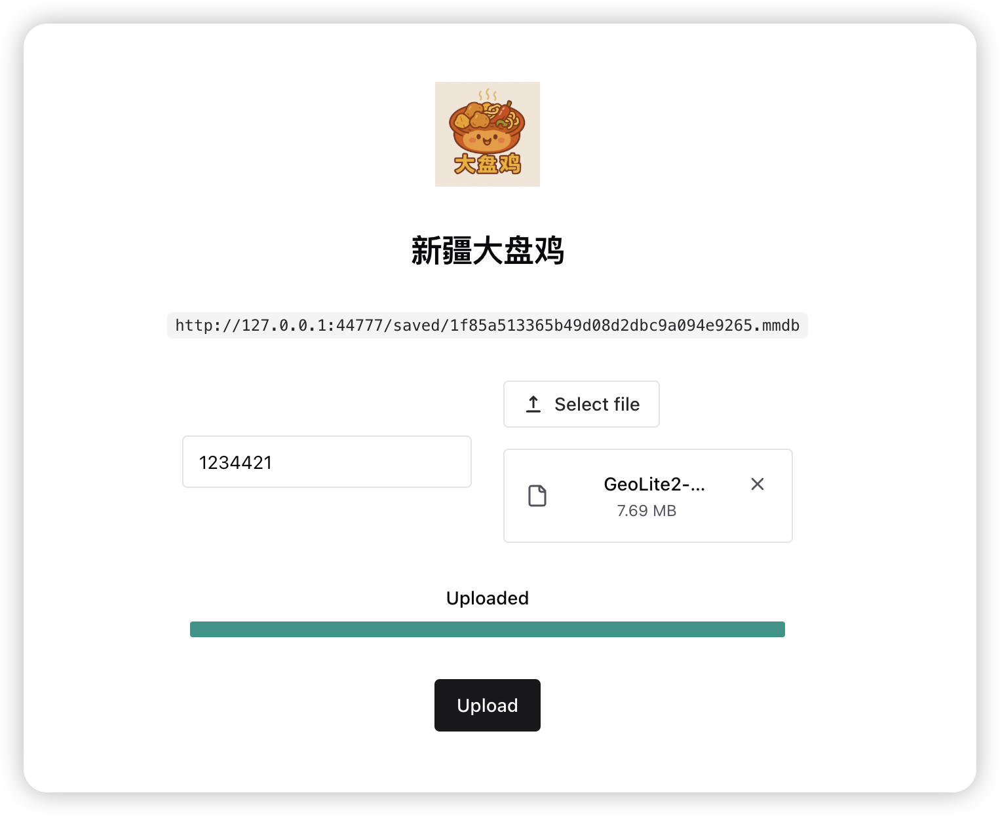

# 🐔 xjdpj - 新疆大盘鸡

> 世界上有两种盘：一种是硬盘，一种是大盘鸡。  
> 我们选了最香的那一个。

**xjdpj（新疆大盘鸡）** 是一款热气腾腾、拥有完全“炒制自主权”的临时文件网盘。

不依赖任何第三方框架，完全自煮自盘，摆脱传统网盘“卡脖子”困境。  
我们秉持“文件自由、鸡块独立”的理念，让上传变得像吃鸡一样简单、爽快、香！

> 没有注册、没有套路、不限辣椒——只有你和你的大盘鸡。

---

## 📸 截图



是不是很香？是不是想吃……哦不是，是想上传文件？

---

## 🥘 介绍

xjdpj 提供这样一个服务：

- ✅ 临时文件上传
- ✅ 下载直链分享
- ✅ 自动过期清理（48 小时后自动炒掉你的鸡）
- ✅ 文件越大，我们越骄傲（支持最大上传 10G）
- ❌ 不香菜、不过油、绝不限制辣度

---

## 🐔 为什么叫 xjdpj？

- **xj** = 新疆
- **dpj** = 大盘鸡
- 合起来就是你永远吃不腻的传输服务：**新疆大盘鸡**

---

## 🚀 如何食用（部署指南）

🛠️ **你需要具备以下调料**：

- Node.js >= 20 🍃（负责炒前端）
- Python >= 3.10 🐍（后端炖鸡）
- [pdm](https://pdm-project.org/latest/) 🧂（Python 包管理器，给鸡加点味）

🍳 **开始炖鸡！**

```bash
git clone https://github.com/BennyThink/xjdpj
cd xjdpj

# 安装后端依赖
pdm install

# 构建前端（准备上桌）
cd frontend && npm install && npm run build
```

🐔 **启动鸡锅：**

```bash
# 选择你的 Python 环境
pdm use

# 启动后端
cd backend
# KEY 是上传用的密钥，不设置就相当于：谁都可以来“吃鸡”
KEY=123 python3 main.py
```

✨ 打开你的锅盖：http://127.0.0.1:44777/ 你将见证一只热气腾腾的鸡。

---

## 📤 上传方式

### 🍗 网页上传

打开 http://127.0.0.1:44777/ 或 http://127.0.0.1:44777/?key=123 如果你想预分享密码

点击上传，选个鸡块（文件）就行。

### 🌀 CURL 上传（适合命令行厨子）

```bash
curl -F "file=@/path/1.mp4" -F "auth=12345" -k -X POST "http://127.0.0.1:44777/"
```

📌 注意：

- `auth` 参数需要和你设置的 `KEY` 一致，没设置就随便写点啥或者忽略。

---

## 📥 下载方式

上传成功后返回的 JSON 中包含直链，复制即可食用！

```json
{
  "link": "http://127.0.0.1:44777/saved/2b4e8ba389d549a8b905aeaf37d18b6c.mp3"
}
```

🌐 直接访问链接，鸡块立刻送达。

---

## ❓FAQ（鸡问鸡答）

> ❓ 文件会永久保存吗？  
> 🐔 不会，48 小时后文件会被“焖掉”，就像遗忘的鸡块。

> ❓ 上传限制多少？  
> 🐔 每块鸡（文件）最大支持 **10G**，想塞什么塞什么！

> ❓ 上传后能改名吗？  
> 🐔 鸡都炖了，你说还能起啥新名字？

> ❓ 支持文件夹上传吗？  
> 🐔 暂时不支持，但你可以打成一个 zip 鸡包，然后当一只鸡腿处理。

> ❓ 支持多文件上传吗？  
> 🐔 当前是逐个来，一个个炖，太多一起怕锅炸。但你可以压个 zip 一锅炖。

> ❓ 支持断点续传吗？  
> 🐔 鸡都是一气呵成炖熟的，我们暂不支持“鸡腿中途冷藏再复热”。

> ❓ 怎么保证安全性？  
> 🐔 不登录、不留名、不记录，只有你和鸡知道。传完记得吃掉。

> ❓ 这个项目是不是认真的？  
> 🐔 我们是认真的搞笑项目，或者搞笑的认真项目，总之——你开心就好。

> ❓ 能不能点个外卖？  
> 🐔 抱歉，我们不炒实体鸡肉，只炒文件。

---

## 📦 Todo（等老板加鸡腿再做）

- [ ] Web 界面美化成一口铁锅，拖文件进锅里自动上传
- [ ] 每次上传随机播放一句“程序员鸡汤”：
  > “别怕失败，连鸡也要炖 48 小时才能入味。”
- [ ] 上传完成后跳出“鸡你太美”音效 + 闪烁动画
- [ ] 文件即将过期时自动发出“锅里还剩两块鸡，速来”提示
- [ ] 微信小程序：**扫一扫，一键吃鸡**
- [ ] 上传大文件时，屏幕中间转圈圈显示“炖鸡中，请稍候”
- [ ] 命令行工具：`xjdpj upload my.mp4` 自动配鸡汤
- [ ] 夜间模式：背景图是新疆星空下的大铁锅
- [ ] GPT 自动生成鸡肉贴图，根据文件名生成菜谱
- [ ] 彩蛋页面：连续上传 10 次触发“隐藏鸡腿成就”
- [ ] 文件即将删除前发送邮件提醒：
  > “这只鸡快凉了，再不吃就没啦～”
- [ ] 用 ASCII 图画出一只鸡，作为 404 页面
- [ ] 做个 logo 动画，点击鸡腿会“啃掉一块”
- [ ] 支持通过脑电波上传（需额外设备与精神力）

> 🧄 以上功能的开发优先级将按“用户上传文件的香气浓度”决定。

---

## ❤️ 鸣谢（鸡鸣而起）

- 🍗 鸡肉提供商：随机超市冷冻区（感谢 2024 年打折活动）
- 🧠 命名灵感：某日肚子咕咕叫，脑子里全是大盘鸡
- 🎨 logo 设计：ChatGPT AI 炒鸡画师（会画也会胡说八道）
- 💻 技术架构：前端清爽如葱，后端稳如老母鸡
- 🧂 文案策划：项目作者 + 深夜加班的胃
- 🐣 鸡汤文案：来自互联网上那些被迫坚强的鸡
- 🤝 鸡友支持：感谢每一位测试时上传奇怪文件的你
- 🍺 灵感源泉：一顿没吃到大盘鸡的饭局 + 被注册完的所有好域名

> “一个人可能撑不起整片服务器，但他可以撑起一整锅大盘鸡。”

## 📄 License

MIT，放心用，尽情吃，鸡命自由 ✊

 